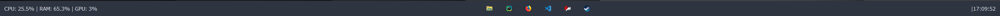

if you want to ro use this app copy the command below and open your terminal and paste it:
`pip install -r requirements.txt`

for monitoring GPU it only works with nvidia gpus not with AMD or Intel gpus!! 

# this is just a basic taskbar, maybe in the future i will make it more advanced!

