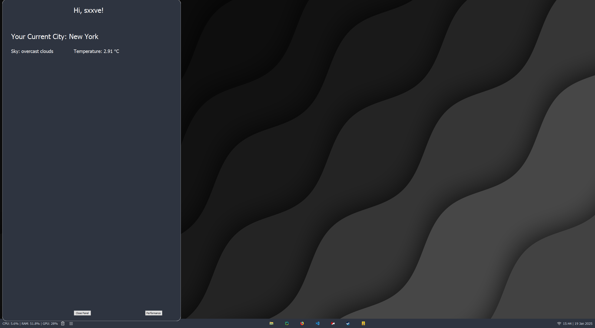
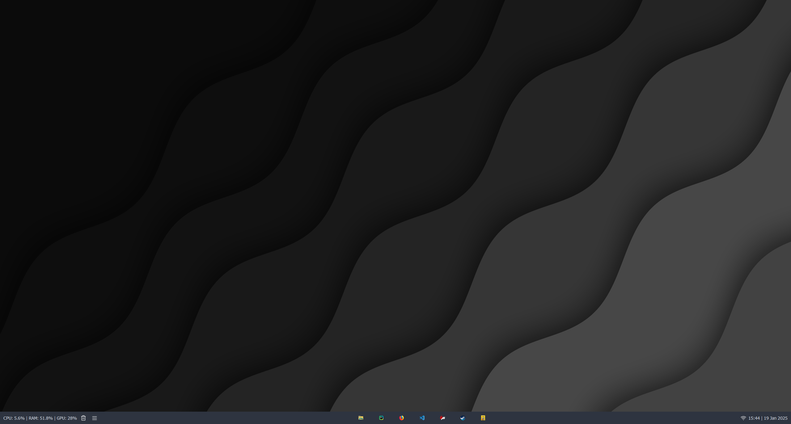
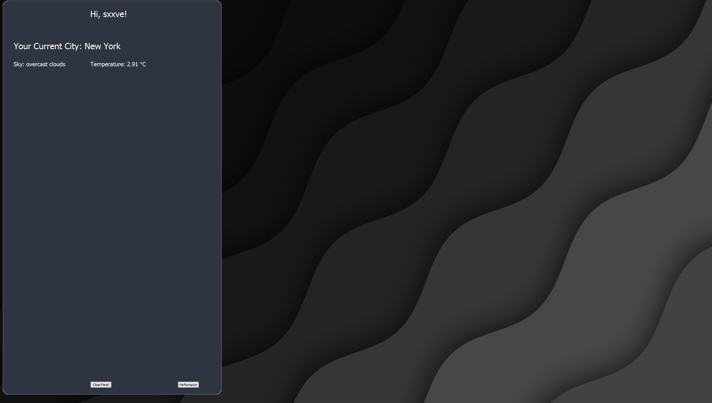

## STILL IN PROGRESS....

# Now working on the side panel!

Caution! make sure you are using python 3.9 when downloading
libraries because a library supports python 3.9
or you can just make an env!

# READ THE `config.ini` IN THE CONFIG FOLDER I'VE EXPLAINED EVERYTHING.

to use this app copy the command below, open your terminal and paste it:
`pip install -r requirements.txt`

in the `config/config.ini` file you can add apps, change layouts. and within the style.css you can make your own style!.

for monitoring GPU it only works with nvidia gpus not with AMD or Intel gpus!! 

